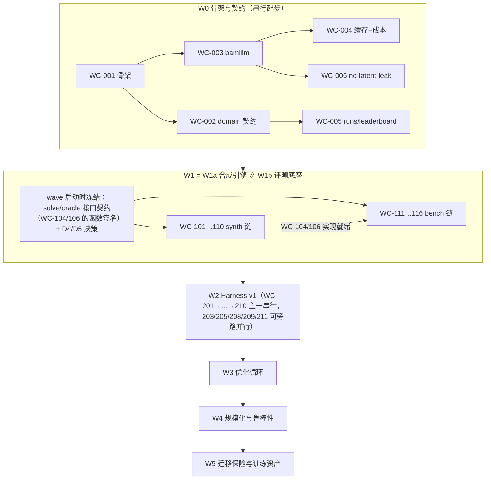

# 合成数据 Harness 工程执行方案（issue #7 补全版，Go 实现面）

> 本文档补全 issue #7「新规划」缺失的工程层：**工作卡分解、依赖与并行关系、难度分级（AI 执行者指派）、四层测试体系**。
> issue #7 的技术内容（指标定义、Harness 规格、合成引擎、优化流程）不在此重复，冲突时以 issue #7 为准。
> 波次（Wave）与 issue #7 的 Phase 对应：W0–W5 = Phase 0, 1+2, 3, 4, 5, 6。
> 决策依据：issue #7（新规划）+ issue #8（本方案）。ADR 编号待人类登记（本仓 CLAUDE.md §4 要求治理路径 PR 引用 ADR）。
>
> **实现面口径**：本仓为 Go+BAML 唯一实现面（ADR-0027）。issue #7 §7.0 的仓库结构是 Python 草图，
> 一律按 §0 的映射落到 Go 布局；Python 线（gitcode 仓）已废弃。

---

## 0. 与本仓现状的关系（已确认的决策 + 开放决策）

### 已确认（人类已批准）

| 决策点 | 内容 |
|---|---|
| D0 | 新模块落 Go 布局：`internal/synth/`（LatentWorld/families/oracle/render/gates）、`internal/solve/`（精确求解 + local search + baselines）、`internal/optimize/`（sweep/calibrate/gepa/promote/worldsearch）；评测扩展进 `internal/bench/` 与 `internal/feedback/`；契约扩展进 `internal/domain/`。新包一律登记 `cmd/archlint/main.go` 的 `layerOf`（AI-GUIDE §5.4）。现有 `internal/engine` 11 阶段即 Harness 底座，W2 在其上演进（IntentCard 富化、slate 打分、校准层）；prompt 契约走 `baml_src/*.baml` + `golden/baml/` 快照流程，不用 `prompts/*.md`。spec 变更走 spec PR；golden 对拍纪律（CLAUDE.md §2）延续到新模块 |
| D1 | Holdout 套件（`holdout/`）由非实现/非优化执行者编写并冻结，见 §5.4 |
| D2 | S2 套件（锁定 holdout 世界）由人类保管人生成与保管，seed 段 [9000,9999] 由其控制 |
| D3 | 波次门禁执行器 = `make check` + CI gate（本仓 `docs/ci-gates.md`、`.github/workflows/ci.yml`），波次出口测试包以 Go test 形态接入该门禁 |

### 开放（开工前必须钉死，否则 W1/W3 会返工）

| 决策点 | 内容 | 选项 |
|---|---|---|
| D4 | 精确求解器技术选型：issue #7 指定 CP-SAT，但 Go 无成熟 CP-SAT 绑定 | (a) pure-Go 分支定界/割平面（n≤120 精确解可控，需 T3 论证正确性）；(b) 外调独立求解服务（IO 归 pipeline 层）；(c) cgo 绑 OR-Tools（引入重依赖，违反"依赖最小"倾向）。**T3 + 人类决策**，WC-104 的前置 |
| D5 | 超参扫描器：issue #7 指定 Optuna TPE（Python 库） | (a) Go 自研网格/随机 + 简化 TPE（O1/O3 离线场景足够）；(b) 外部 Python 驱动仅作优化器前端（产物回写 runs/）。默认 (a)，WC-302 的前置 |

映射速查（issue #7 草图 → 本仓）：`pyproject/pytest` → `go.mod`/`go test`；`contracts/`(pydantic) → `internal/domain/`；`llm/` → `internal/bamlllm/` + `internal/signal/` 离线替身；`prompts/*.md` → `baml_src/*.baml`；`traces/*.jsonl`、`worlds/`、`runs/`、`leaderboard.md`、`test_unlock_log.md`、`decisions.md` 原样保留；PrefMatrix 落盘格式由 WC-206 定（Go 无原生 parquet，JSONL 起步）。

---

## 1. 执行者分级（难度 → 用什么级别的执行者）

分级原则：**涉及"真值、目标函数、统计判定"的卡 ≥T3；纯管道/IO/格式的卡 ≤T2；假设登记、解锁、验收签字必须人类在场。**

| 级别 | 定义 | 执行者 | 审查要求 |
|---|---|---|---|
| **T1** | 机械/脚手架级：目录、配置、落盘格式、追加器 | 低级代码 agent 或脚本 | CI 绿即可，人类抽查 |
| **T2** | spec 明确实现级：接口与行为在 issue #7 或本文已写死 | 中级代码 agent（标准施工） | 卡级 L1 测试全绿 + PR review |
| **T3** | 方法论/数学正确性级：求解器、指标、效用族、prompt 反偏置、评测归因 | 高级 agent | 必须有**人类 review 点**（数学推导核对 + 反例抽查），不许自评通过 |
| **H** | 人类任务：假设预登记、S2 解锁、targets.yaml 重设、意图验收签字 | 人类 | 记录进 `decisions.md` / `test_unlock_log.md` |

---

## 2. 工作卡总表

每卡字段：产出 / 依赖 / 难度 / L1 工作卡测试 / 验收标准。PR 规则按本仓 AGENTS.md：一卡一 PR、diff <400 行（大卡拆子 PR）、Conventional Commits。

### W0 — 骨架与契约（对应 Phase 0，2–3 天）

| 卡 | 内容与产出 | 依赖 | 难度 | L1 测试 | 验收 |
|---|---|---|---|---|---|
| WC-001 | 骨架扩展：go.mod、`configs/` 等价物（`config/default.yaml` 扩展节）、`worlds/`、`runs/`、`traces/` 目录规范；`make check` 保持全绿 | — | T1 | `make check` 绿 | issue P0-1 |
| WC-002 | `internal/domain/` 扩展：IntentCard、DirScore、PrefMatrix、Matching、RunRecord 强类型 + JSON 序列化契约 + `schema_version` | 001 | T2 | 序列化 round-trip、版本字段存在、未知字段拒绝（go test） | issue P0-2 |
| WC-003 | `internal/bamlllm/` 扩展：结构化输出、重试、超时、并发限流（BAML 客户端桥接） | 001 | T2 | fake 客户端的重试/超时/限流用例 | issue P0-3 |
| WC-004 | 持久化缓存（key=sha256(stage,input_json,prompt_hash,model,temp,seed)）+ 逐调用成本计量；落 `internal/store/` | 003 | T2 | 二次运行命中率=100%；key 任一分量变化必 miss | issue P0-3/DoD |
| WC-005 | RunRecord + `runs/` 落盘规范 + `leaderboard.md` 追加器 | 002 | T1 | dummy run 产出完整 `runs/<id>/` | issue P0-4 |
| WC-006 | 隐变量泄漏扫描测试（goldentest 同族）：扫描所有发给模型的 payload，出现隐变量字段名/tag 字面即失败 | 003 | T2 | 自验证：注入隐变量字段名 → 测试必须失败 | issue P0-5 |

**W0 出口**：`make check` 全绿；dummy run 完整落盘；缓存二次命中率 100%；成本报表准确到调用级。

### W1a — 合成引擎（对应 Phase 1，4–6 天；与 W1b 并行，见 §3）

| 卡 | 内容与产出 | 依赖 | 难度 | L1 测试 | 验收 |
|---|---|---|---|---|---|
| WC-101 | `internal/synth/latent.go`：LatentAgent + latent block model + 热点节点 + 稀疏度 + needle/trap/orphan 植入（RNG 走 `internal/rng`，保证 seed 复现） | 002 | T3 | 分布断言（块内互补概率>块间）；植入计数=manifest；同 seed 逐位复现 | issue §3.2 |
| WC-102 | `internal/synth/domains/` 6 包：assoc/bizdev/invest/edu（可见）+ mentor/conf（留出） | 101 | T2 | 词表/属性域 schema 校验；留出包白名单加载测试 | issue §3.2 |
| WC-103 | `internal/synth/families.go`：7 个效用族 + u/p 计算（硬约束归零、噪声截断） | 101 | T3 | 各族手算用例；hard violated → u=0；σ 为难度旋钮且 seed 复现 | issue §3.3 |
| WC-104 | `internal/solve/exact.go`：切线线性化 NSW b-matching，精确解 + gap 报告（**技术选型见 D4**） | 002, D4 | T3 | 暴力枚举 vs 精确解完全一致（n≤12，≥50 随机实例）；n=60 M\* <20s；OracleBoundGap=0 | issue P1-DoD |
| WC-105 | `internal/solve/localsearch.go`：swap/2-opt/rotate + 贪心热启动 | 104 | T2 | 容量约束恒保持；结果不劣于热启动 | issue §2.7 |
| WC-106 | `internal/synth/oracle.go`：真 u/p/M\*，**复用 WC-104 同一份求解代码** | 103, 104 | T2 | 断言调用同一求解入口（归因干净）；小规模与暴力枚举一致 | issue §3.3 |
| WC-107 | `internal/synth/render.go` + 渲染 prompt 契约（baml_src）：8 类扰动（省略/换说法/夸大/冗长/结构/语言/噪声/埋点） | 101, 102 | T3 | 渲染产物 schema 校验；occlusion 应用记录与 latent 一致 | issue §3.4 |
| WC-108 | `internal/synth/gates.go`：四闸门（反演泄漏 0.45–0.80 / 保真 ≥0.90 / 真实性 AUC≤0.65 / KS p>0.05） | 107 | T2 | 构造过直白样本与失真样本，闸门必须正确拒收 | issue P1-DoD |
| WC-109 | 生成并冻结 S0/S1/S4 + manifest 哈希入库 | 101–108 | T1 | seed 段隔离强制测试；manifest 复核 | issue P1-DoD |
| WC-110 | **S2 生成与锁定**：含 2 留出族 + 留出渲染器 + 2 留出领域包，seed∈[9000,9999] | 101–108 | **H** | 由 D2 保管人执行；生成记录进 `test_unlock_log.md` | 见 §5.4 |

### W1b — 评测底座（对应 Phase 2，3–4 天；与 W1a 并行）

| 卡 | 内容与产出 | 依赖 | 难度 | L1 测试 | 验收 |
|---|---|---|---|---|---|
| WC-111 | `internal/solve/baselines.go`：B0–B5 全部在同一 PrefMatrix 上运行 | 104, 105 | T2 | 每 baseline 小世界性质测试（B0 可行性、B2 对称化语义、B5 稳定性） | issue §1.4 |
| WC-112 | `internal/bench/metrics.go`：记分卡全指标（NWA/EMM/Cov@1/FMR/OrphanF1/CeilingRatio/PairSpearman/MutualAUC/ECE/DirAsym/TrapPrecision/ConstraintRecall/ImpliedNeedRecall/SolverGap/ReasonRecall/Faithfulness + Gini/MaxLoad/Cost） | 002, 106 | T3 | 手算小例覆盖每个指标；边界用例（空匹配、全孤儿、单人世界） | issue §1.3 |
| WC-113 | `internal/bench/stats.go`：paired bootstrap、Wilcoxon、seed 方差、Holm 校正 | 112 | T2 | 已知分布的统计性质测试（CI 覆盖率、单调性） | issue §4.3 |
| WC-114 | Fake Harness：隐变量+可调噪声直接当 û，零 LLM 成本（`internal/signal` 离线替身同族） | 103 | T2 | **噪声=0 → NWA=1.000±1e-6（管道自洽性证明）** | issue P2-DoD |
| WC-115 | `internal/bench/swap.go`：C1–C6 oracle-swap + waterfall 数据 | 106, 111, 114 | T2 | Fake Harness 下 C1 NWA=1；三项损失分解非负；C5 复用 C3 缓存验证 | issue §4.1 |
| WC-116 | 报告产物：scorecard.json + report.html（记分卡+waterfall+分族+可靠性图+Pareto） | 112, 115 | T1 | 产出含全部必备区块；S1 上 <60s | issue P2-DoD |

**W1 出口（W1a+W1b 合并验收）**：issue Phase 1/2 全部 DoD + 噪声递增 NWA 单调下降曲线平滑 + B0 的 NWA≈0.00±0.03。

### W2 — Harness v1 打通（对应 Phase 3，5–7 天）

> 底座 = 现有 `internal/engine` 11 阶段。本波次将其升级为 issue #7 的 Stage 0–8 语义；engine 保持纯变换，IO 归 pipeline。

| 卡 | 内容与产出 | 依赖 | 难度 | L1 测试 | 验收 |
|---|---|---|---|---|---|
| WC-201 | Stage 0 升级：IntentCard 富化（hybrid 词表、implied 推断、span 强制、claim 折扣、self_consistency_k）；prompt 走 baml_src | 002–004 | T3 | 离线替身契约测试；span 缺失拒收；结构化输出 schema 校验 | issue §2.1 |
| WC-202 | Stage 1 升级：4 视图召回（seek→offer / offer→seek / 结构化硬过滤 / BM25）+ 融合配额（pair_policy、cand_per_node、max_appearance_per_node、diversity） | 201 | T3 | 各视图独立单测；配额强制；pair_policy OR/AND 语义 | issue §2.2 |
| WC-203 | Stage 2：规则引擎 + reason_code + 可选 cheap-LLM 二元判定 | 201 | T2 | 规则表驱动测试；违反硬约束必 ineligible 且 reason_code 正确 | issue §2.3 |
| WC-204 | Stage 3 升级：slate 调用形态、行为锚点 0–4、**6 条反偏置强制条款**、位置随机化、borderline 置换均衡（baml_src prompt 契约） | 202, 203 | T3 | 输出 schema 校验；离线替身的 slate 内排序稳定；6 条款在 baml_src 文本中的存在性断言（防后续优化删条款） | issue §2.4 |
| WC-205 | Stage 4：`internal/feedback/` 校准扩展（isotonic/Platt + 分层拟合 + 置信收缩） | 204 | T2 | 合成标签下 ECE 收敛；等距回归单调性 | issue §2.5 |
| WC-206 | Stage 5：PrefMatrix 落盘格式（unknown vs low、unknown_fill；JSONL 起步，格式本卡定稿） | 205 | T1 | round-trip 一致；unknown 标记语义测试 | issue §2.6 |
| WC-207 | Stage 6：求解接入（复用 WC-104；objective/reciprocity 模式、fallback） | 104, 206 | T2 | 与直接调求解器结果一致；同 PrefMatrix 重复求解逐位一致 | issue §2.7 |
| WC-208 | Stage 7：MatchCard 从 matched_needs+evidence 结构化生成，span 强制 | 204 | T2 | 无 span 支撑不出卡；Faithfulness 抽检脚本 | issue §2.8 |
| WC-209 | Stage 8：`traces/` 四类 JSONL（extraction/pairscore/recall/match，带 schema_version） | 201–208 | T2 | 四类 jsonl 按 issue §6.2 schema 逐字段校验 | issue §6.2 |
| WC-210 | `internal/pipeline/` 编排升级 + oracle-swap 注入点（R/S/X 可替换为 R\*/S\*/X\*） | 201–209 | T3 | 注入 oracle 组件的接口测试；与 WC-115 联调 | issue §2.9/§4.1 |
| WC-211 | `internal/bench/taxonomy.go`：11 类错误自动分桶 + top 实例导出 | 209, 112 | T2 | 构造已知错误类型 → 正确入桶；桶统计字段完整 | issue §4.4 |
| WC-212 | MT1–MT10 metamorphic 测试（Go test；离线替身进 CI，真 LLM 进 nightly） | 210 | T3 | 自身即测试；**MT2（反对称化）、MT3（硬约束）不通过则 prompt 返工** | issue §4.2 |
| WC-213 | `targets.yaml`（或 config 等价物）按实测水位重设一次并锁定（此后只升不降） | W2 全部 | **H** | 重设记录进 `decisions.md` | issue §1.3 注 |

**W2 出口**：S0 全流程跑通；S1 出首份 baseline scorecard + waterfall；MT≥8 过且 MT2/MT3 必过；leaderboard 首条 NWA 记录（B1–B5 同出）；`pairscore.jsonl` ≥5 万条带真值。

### W3 — 优化循环（对应 Phase 4，8–12 天，主战场）

| 卡 | 内容与产出 | 依赖 | 难度 | L1 测试 | 验收 |
|---|---|---|---|---|---|
| WC-301 | `internal/optimize/promote.go`：硬规则（dev NWA CI 下界>0、worst-family 降幅≤0.02、FMR 不升、成本上限、>10 配置时 Holm 校正），不许人工判断 | 113 | T2 | 构造接受/拒绝/边界场景，判定全部正确 | issue §4.3 |
| WC-302 | O1 `internal/optimize/sweep.go`：在缓存 PrefMatrix 上扫求解器旋钮（κ/τ_mutual/unknown_fill/objective/ε），200–500 trials（**扫描器选型见 D5**） | 206, 301, D5 | T2 | 离线重放确定性；输出 NWA-FMR-Cov 三维权衡曲线 | issue §5.1 |
| WC-303 | O2 校准器闭式/网格优化 | 205, 301 | T2 | ECE 下降且可靠性图更新 | issue §5.1 |
| WC-304 | O3 召回旋钮扫描：CeilingRatio vs cand_per_node 曲线（成本档位依据） | 202, 112 | T2 | 曲线单调性合理；结果落 leaderboard | issue §5.1 |
| WC-305 | O4/O5 `internal/optimize/gepa.go` + `feedback.go`：Pareto 候选池、minibatch 双层评分（pair 级稠密 fitness + 系统级 NWA 门控）、build_feedback 含 top-3 错误桶+真值驱动因素、prompt 长度惩罚、**必须保留条款清单** | 201, 204, 211, 301 | T3 | feedback 构造测试（含桶名/真值/系统后果）；安全条款保留检查（反射产物 diff 扫描） | issue §5.2 |
| WC-306 | E7 蒸馏空间探针：三档模型（frontier/mid/cheap-small）同一 dev 套件 NWA-成本三点曲线 | 204 | T2 | 三点曲线产出；结论写进 `decisions.md`（P1 是否立项） | issue §6.3 |
| WC-307 | O7 模型档位 Pareto + self-consistency/duel 预算决策 | 302–306 | T2 | Pareto 前沿图；决策记录 | issue §5.1 |
| WC-308 | **Test Unlock #1**：登记 3 个假设 → S2 × 3 seeds → 结果与决策写 `decisions.md` | W3 全部 | **H**+T2 | 解锁记录进 `test_unlock_log.md` | 见 §5.4 |

**W3 出口（Phase 4 Gate）**：S1 dev NWA≥0.75、worst-family≥0.60、FMR≤0.10、Cov@1≥0.85、ECE≤0.07；S2 NWA≥0.68 且 dev-test gap≤0.12（>0.12 判过拟合回炉）；SYS vs B2/B3/B4 三项对比 CI 下界>0；waterfall 三项损失均<0.10；MT1–MT10 全过；E7 决策记录完成。

### W4 — 规模化与鲁棒性（对应 Phase 5，5–7 天）

| 卡 | 内容与产出 | 依赖 | 难度 | L1 测试 | 验收 |
|---|---|---|---|---|---|
| WC-401 | S3 规模化：n=300/1000 求解器时间/质量曲线、localsearch 兜底验证、大 N 下配额重调 | W3 | T2 | n=1000 端到端 <30min；SolverGap≥0.97 | issue P5-DoD |
| WC-402 | S4 shift 全量评测 → `failure_modes.md`（产品边界说明书） | W3 | T2 | worst-world NWA≥0.45；每个失败模式有归因 | issue P5-DoD |
| WC-403 | `internal/optimize/worldsearch.go`：150 trials 最大化 regret → 20 个最难世界组成 S5 → 课程学习 → 二次搜索 | 101, 301 | T3 | 二轮最难世界 NWA 比一轮提升≥0.10（泛化证据） | issue §5.4 |
| WC-404 | 生产三档定档：economy/balanced/premium（$/member、NWA、p95） | 401–403 | T2 | economy 档 ≤$0.15/member | issue P5-DoD |
| WC-405 | **Test Unlock #2** | W4 全部 | **H** | 解锁记录 | 见 §5.4 |

### W5 — 迁移保险与训练资产（对应 Phase 6，4–5 天）

| 卡 | 内容与产出 | 依赖 | 难度 | L1 测试 | 验收 |
|---|---|---|---|---|---|
| WC-501 | 真实数据影子跑（无标注）：MT1–MT10 + 无真值指标 + 分布漂移报告（偏离>2σ 项） | W3 产物 | T3 | 漂移报告产出且每项有结论 | issue P6-1 |
| WC-502 | 按漂移报告回补世界参数 → 生成 S1′ → 重跑确认 NWA 不塌 | 501 | T2 | S1′ 上 NWA 相对 S1 下降 ≤0.08 | issue P6-DoD |
| WC-503 | 训练集导出 p1–p5（按 world 切分 train/val/test）+ datasheet | 209 累积 | T2 | 五个数据集过 schema 校验；P1 ≥80 万条带 `latent.u_true` | issue P6-DoD |
| WC-504 | 冻结 harness.v1 基线制品（config + baml_src + calibrator） | W5 全部 | T1 | 制品哈希登记；后续所有对比以此为锚 | issue P6-4 |

---

## 3. 依赖与并行关系

**并行要点**：

1. **W1a ∥ W1b**：波次启动会上先冻结 WC-104/106 的接口签名（半小时的人类+T3 会议）并敲定 D4/D5，之后两链并行；W1b 的 WC-115/116 联调时等 WC-104/106 落地。
2. **W2 内部**：主干 201→202→204→206→207→210 串行；203 在 201 后即可并行；205 在 204 后、208/209 在 204 后、211 在 209 后均可并行；212（MT 测试）从 204 起逐步累积编写。
3. **W3 内部**：WC-302（O1）/303（O2）/304（O3）三者并行（不同预算池）；WC-305（O4/O5）在 301 后即可启动，与 302–304 并行；306（E7）任意时刻可插入；308（解锁）必须最后。
4. **关键路径**：W0 → WC-101/104（合成+solver）→ WC-201/204（抽取+精排）→ WC-305（GEPA）→ WC-308。整条路径上全是 T3 卡，是人力排布的重点。
5. **跨波次冻结**：每波出口验收通过后，该波产物（世界、fixture、接口、targets）冻结，后续波次只允许 forward-append。

---

## 4. 测试体系总览（四层）

| 层 | 名称 | 回答的问题 | 作者 | 运行时机 | 失败后果 |
|---|---|---|---|---|---|
| L1 | 工作卡测试 | 这张卡做对了吗 | 卡的实现者（随卡 PR 提交） | 每次提交（`make check`） | 卡不收，PR 不合并 |
| L2 | 波次测试 | 这一波拼起来成立吗 | 波次内各卡实现者 + 波次负责人 | 波次出口（gate） | 波次不放行，产物不冻结 |
| L3 | 人类意图验收测试 | 这是人类要的东西吗 | 人类（本文 §5 给出清单） | 里程碑（W2/W3/W4/W5 出口） | 里程碑不通过，回炉 |
| L4 | Holdout 测试 | 改进是泛化还是过拟合 | **非实现者**（D1 指派人/独立会话） | 仅 gate 时解锁运行 | 判过拟合，优化成果作废回炉 |

铁律：**L1/L2 对实现 agent 完全可见（它们定义"做对"）；L4 对实现与优化 agent 不可见内容、只见 pass/fail 汇总（它定义"没作弊"）。L3 由人类执行，agent 只能准备材料。**

### 4.1 L1 工作卡测试

逐卡列在 §2 表中。补充规则：

- 每卡 PR 必须带测试（Go test），`make check` 必跑；沿用本仓铁律（engine 纯变换不碰 IO、参数走 config、map 遍历排序、golden 逐位对拍）。
- LLM 相关卡一律双层：`internal/signal` 离线替身测试进 CI（确定性、免费），真 LLM 版本进 nightly。
- 测试即 spec 暴露器：写测试时发现 issue #7 没讲清的边界，回到 issue/spec 补充，**不许在实现里 hack**。

### 4.2 L2 波次测试

每波出口跑对应集成测试包，全绿才冻结产物、放行下一波：

| 波次 | 波次测试包 | 通过标准 |
|---|---|---|
| W0 | `make check` + dummy run 端到端 | ci 绿；`runs/<id>/` 完整；缓存二次命中率 100%；成本到调用级 |
| W1 | 求解正确性 + 渲染四闸门 + 套件完整性 + **Fake Harness 自洽** | 暴力枚举一致（≥50 实例）；四闸门区间达标；manifest 声明与实际分布一致；噪声=0→NWA=1.000±1e-6；噪声递增 NWA 单调平滑下降；B0≈0±0.03；S1 全报告 <60s |
| W2 | S0/S1 端到端 + MT 套件 + 资产齐备 | S0 全流程；S1 首份 scorecard+waterfall；MT≥8 且 **MT2/MT3 必过**；B1–B5 同出；pairscore ≥5 万条；targets 锁定 |
| W3 | Phase 4 Gate 全套（见 §2 W3 出口） | dev/test 门槛 + 三项基线对比 CI + waterfall 三损 <0.10 + MT 全过 |
| W4 | 规模化 + 鲁棒性 + 对抗泛化 | n=1000<30min；SolverGap≥0.97；economy≤$0.15/member；S4 worst-world≥0.45；对抗二轮提升≥0.10 |
| W5 | 漂移 + 数据集 + 制品冻结 | 漂移报告完成；S1′ NWA 降幅≤0.08；5 数据集 schema 校验过且 P1≥80 万条；harness.v1 冻结 |

执行器：波次测试包以 Go test 形态接入本仓 CI gate（D3）。退出语义三态（过 / 挂 / 需人工）与 `docs/ci-gates.md` 对齐。

---

## 5. L3 人类意图验收测试

这些测试不从实现推导，而从**业务意图**推导——回答"这是人类要的东西吗"。每条在里程碑验收会上由人类逐条确认，结果签字进 `decisions.md`。

| ID | 意图 | 测试方法 | 通过标准 |
|---|---|---|---|
| HI-1 | **系统敢说"这轮没有好匹配"**（κ 机制的存在意义） | 构造全孤儿世界（thinness 拉满），人工看输出 | 系统返回空/近空匹配并给出说明，而非填满容量 |
| HI-2 | **推荐 ≠ 匹配**（互惠折扣） | 构造 A 极想见 B、B 完全不想见 A 的对子，人工核对 | 该对不出现在最终匹配；报告中可见其被互惠折扣压掉 |
| HI-3 | **反马太**（NSW 的公平性） | 看明星会员的 MaxLoad 与 Gini，对比 B4（USW） | SYS 在 Cov@1/Gini 上显著优于 B4（CI 下界>0） |
| HI-4 | **孤儿被诚实识别**（abstention 质量） | 人工抽 10 个系统留空的人 vs oracle 认定无合格对象的人 | OrphanF1≥0.70 且抽样的留空理由说得通 |
| HI-5 | **解释可信** | 人工抽 20 张 MatchCard，逐条核对 span 支撑与双方视角 | Faithfulness≥0.95；无自由发挥的事实断言 |
| HI-6 | **"变好了"三个字可信**（统计纪律） | 审查 leaderboard 的 promote/reject 记录 | 每条改进声明都带 paired bootstrap CI 与 Wilcoxon p；无 σ>0.5×效应量的宣称 |
| HI-7 | **成本可承受** | 审查三档成本报表 | economy 档 ≤$0.15/member；缓存命中率在报告中可见 |
| HI-8 | **"什么时候不灵"可回答** | 人类读 `failure_modes.md`，向系统提 3 个边界问题 | 文档能回答；对抗搜索产物（S5）与文档结论一致 |

协议：验收会材料由 agent 准备（scorecard、waterfall、抽样包），**判断由人类做**；任何一条不过 → 对应波次回炉，不许"先记录遗留问题往前走"。

### 5.4 L4 Holdout 测试（最重要）

Holdout 的唯一目的：**区分"真泛化"与"对评测装置过拟合"**。它失效的方式只有一种——被优化过程看见。因此本层设计以隔离为核心。

**H-1 数据 holdout（issue #7 已有，制度化）**
- S2 套件锁定：含 2 留出效用族（PRESTIGE/HOMOPHILY）+ 留出渲染器 + 2 留出领域包（mentor/conf）；seed∈[9000,9999]，代码硬编码禁交叉。
- 解锁配额：全项目 ≤6 次；每次提前登记 3 个假设到 `test_unlock_log.md`；用完即止。
- S2 生成与保管由 D2 指派人执行（WC-110），优化 agent 无读取权限。

**H-2 测试 holdout（本文新增，核心增量）**
- `holdout/` 顶层 Go 包由 D1 指派的**非实现者**编写，内容不进任何实现/优化 agent 的上下文。
- 内容两部分：
  1. **MT11–MT15 隐藏变体**（实现者只知道 MT1–MT10）。
  2. **12 个人工业务陷阱场景**（`holdout/scenarios/HT-01..12.json`），期望行为由人类写死。
- 冻结：全部文件 sha256 登记进 `holdout/manifest.json`；`holdout/manifest_test.go` **常驻 CI**（不解锁也跑，专司防篡改）；任何改动需人类 owner 批准（CODEOWNERS，见治理 issue）。
- 可见性纪律：gate 运行时优化 agent 只能看到 pass/fail 汇总与计数，**看不到失败详情**；详情只对人类可见。
- 运行时机：默认 `go test` 下 holdout 测试全部 skip（`t.Skip`），仅 gate 时由人类以 `MUTUAL_HOLDOUT=1 go test ./holdout/` 解锁运行；W2/W3/W4/W5 出口各一次。
- 首版套件（MT11–MT15 + HT-01–12 + manifest）已由 D1 作者随本方案一并落库。

**H-3 世界再生成协议（issue §5.3-5 强化为硬门）**
- 每 2 轮优化换 seed 段重生成 S1′（同参数不同实例）；S1′ 上 NWA 降幅 >0.05 触发过拟合审查，>0.10 直接回炉。

**H-4 泛化判据（issue 已有）**
- S2 NWA 允许比 dev 低 ≤0.07；gap >0.12 判定过拟合，本轮优化成果作废。

**H-5 防泄漏 CI（自动化兜底）**
- 隐变量泄漏扫描（WC-006）：payload 出现隐变量字段名/tag 字面即失败。
- suite loader 白名单：优化循环代码路径物理上无法 import 留出族/留出渲染器/留出包。
- GEPA fitness 含 prompt 长度惩罚；反射产物 diff 扫描"必须保留条款清单"（WC-204/305 的 L1）。
- `holdout/manifest_test.go` 哈希校验常驻 CI：holdout 文件被改动 → CI 红 + 人类审查。

**L4 失败处置**：任何 holdout 层失败不是"再修一个 bug"，而是**本轮优化方向作废**——回到 waterfall，重选优化层。这条写进 promote 的前置门（WC-301）。

---

## 6. 治理与变更控制

1. **promote 硬逻辑**（WC-301）：改动被接受 ⟺ dev NWA CI 下界>0 ∧ worst-family 降幅≤0.02 ∧ FMR 不升 ∧ 成本未超上限 ∧（>10 配置扫描时）Holm 校正后仍显著。不许人工 override，人为例外只能改 promote 代码并留 PR 记录。
2. **targets 只升不降**：W2 出口按实测水位重设一次并锁定（WC-213，人类执行）；此后任何放松必须走 `decisions.md` 记录的人类决策。
3. **记录三件套**：`leaderboard.md`（每次 run 自动追加）、`test_unlock_log.md`（每次 S2/holdout 解锁）、`decisions.md`（每次人类决策）。
4. **spec 变更纪律**：沿用本仓 CLAUDE.md/AI-GUIDE——实现暴露 spec 沉默时改 spec（独立 PR），不许 hack 实现。
5. **每轮优化前必跑 waterfall**（issue §5.1 执行铁律）：钱只花在损失最大的一层；波次门禁检查 waterfall 产物存在且三损<0.10。

---

## 7. 开工顺序（可直接派工）

1. 人类敲定 D4/D5（本文 §0 开放决策）。
2. W0 六卡（WC-001 先行，其余并行）。
3. W1 启动会：冻结 solve/oracle 接口签名 → W1a/W1b 并行；WC-110（S2 生成锁定）由 D2 保管人在本波内完成。
4. **纪律线（issue #7 原话，作为 W2 开工前置门）：Fake Harness 未通过"噪声=0 → NWA=1.000"之前，不写任何 LLM 相关的 Harness 代码。**
5. W2 → L2/L3/L4 联合验收 → W3（主战场，预算 $6k–10k 立项）→ W4 → W5。

**总卡数 52（T1×6 / T2×29 / T3×13 / H 参与×4）；总工期按 issue 估算 27–39 天，并行后日历工期约 20–28 天。**
